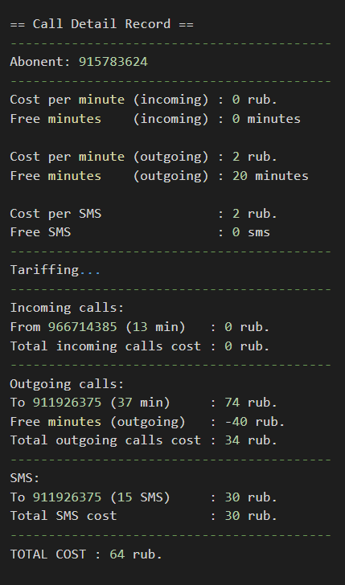
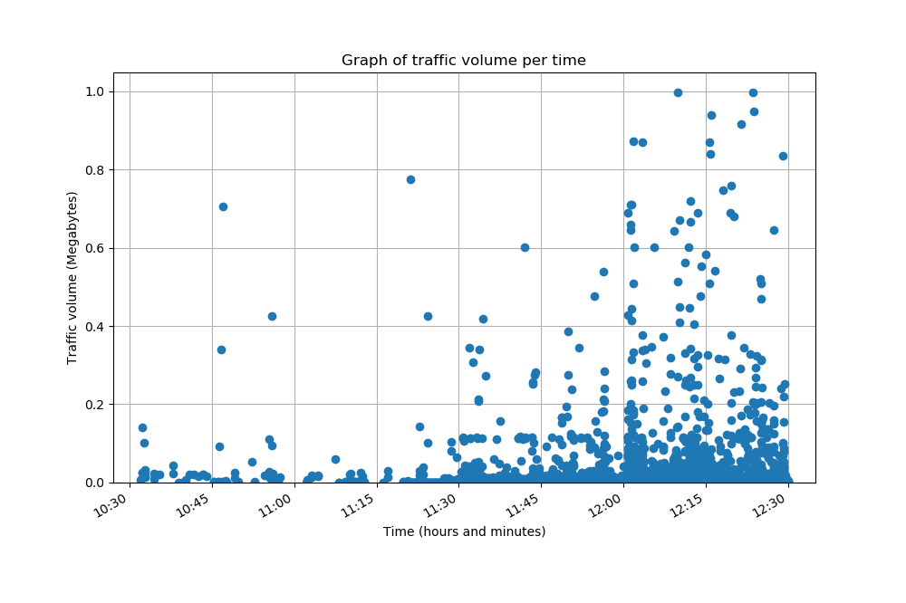
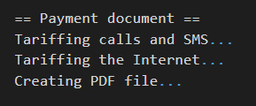
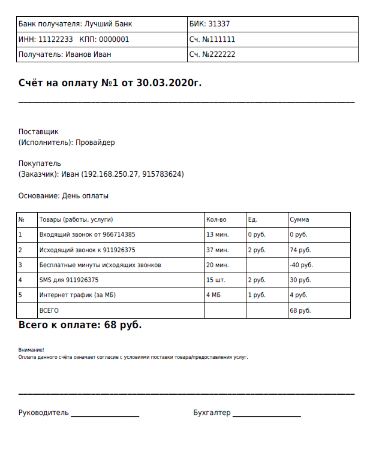

# mobile-billing

## CDR (Call Detail Record)


```
.
└── CDR
    ├── images\
    ├── cdr.py
    ├── data.scv
    └── reports\
```

## NetFlow



```
.
└── NetFlow
    ├── images\
    ├── netflow.py
    └── reports\
```

## Payment



```
.
├── fonts\
├── images\
├── payment.py
├── payment.pdf
└── reports\
```